# Системы программирования — Лабораторная работа (EX11)
## PL/1 → Ассемблер S/360 → Объектный код → Загрузчик/Отладчик

---

## 1. Описание проекта

Проект реализует полный конвейер трансляции и исполнения программы на языке PL/1 для архитектуры IBM System/360:

| Этап | Программа | Вход | Выход |
|------|-----------|------|-------|
| Компиляция | `komppl.c` | `ex11.pli` | `ex11.ass` |
| Ассемблирование | `kompassr.c` | `ex11.ass` | `ex11.tex` |
| Загрузка и выполнение | `absloadm.c` | `ex11.tex` | Интерактивный отладчик |

---

## 2. Структура репозитория

```
.
├── Dockerfile
├── README.md
└── src/
    ├── komppl.c          — компилятор PL/1 → Ассемблер
    ├── kompassr.c         — ассемблер → объектный код
    ├── absloadm.c         — загрузчик, эмулятор, отладчик
    ├── Makefile
    ├── StartTestTask      — скрипт полного цикла
    ├── GenSysProg
    ├── pics/              — скриншоты отладчика (12 шагов)
    ├── step1/
    │   ├── ex11.pli       — исходная PL/1 программа
    │   ├── ex11.ass       — результат компиляции
    │   ├── ex11.tex       — объектный файл
    │   └── spis.mod       — список модулей для загрузчика
    └── build/             — собранные бинарники
```

---

## 3. Высокоуровневый эквивалент программы (PL/1)

```
EX11: PROC OPTIONS ( MAIN );
  DCL A BIN FIXED INIT ( 3 );
  DCL B DEC FIXED INIT ( 3 );
  DCL C BIN FIXED;

  C = B * 5;       /* C = 3 * 5 = 15          */
  C = A = C;       /* C = (A == C) = (3 == 15) = 0 (FALSE) */
END EX11;
```

**Смысл:** вычислить `B * 5`, записать результат в `C`, затем сравнить `A` с `C` и записать булев результат (0 или 1) обратно в `C`.

**Ожидаемый результат:** `C = 0` (FALSE), так как `A(3) ≠ C(15)`.

---

## 4. Таблица операций (КОП)

| Метка | КОП | Операнды | Формат | Код | Пояснение |
|-------|-----|----------|--------|-----|-----------|
| `EX11` | `START` | `0` | — | — | Начало программы, счётчик адресов = 0 |
| | `BALR` | `@RBASE,0` | RR | `05 50` | Загрузить адрес следующей команды в базовый регистр R5 |
| | `USING` | `*,@RBASE` | — | — | Объявить R5 базовым регистром для адресации |
| | `ZAP` | `@BUF(8),B(3)` | SS | `F8 72 503E 5034` | Скопировать packed-значение B в рабочий буфер @BUF |
| | `MP` | `@BUF(8),@FIVE(1)` | SS | `FC 70 503E 503A` | Умножить @BUF на константу 5 |
| | `CVB` | `@R1,@BUF` | RX | `4F 60 503E` | Преобразовать packed decimal → binary, результат в R6 |
| | `STH` | `@R1,C` | RX | `40 60 5038` | Записать R6 (полуслово) в переменную C |
| | `LH` | `@R2,A` | RX | `48 20 5032` | Загрузить значение A в R2 |
| | `CH` | `@R2,C` | RX | `49 20 5038` | Сравнить R2 с C, установить код условия |
| | `BC` | `8,@TRUE` | RX | `47 80 5028` | Если равны (CC=0) → перейти к @TRUE |
| | `LA` | `@R3,0` | RX | `41 30 0000` | R3 = 0 (FALSE) |
| | `BC` | `15,@SAVE` | RX | `47 F0 502C` | Безусловный переход к @SAVE |
| `@TRUE` | `LA` | `@R3,1` | RX | `41 30 0001` | R3 = 1 (TRUE) |
| `@SAVE` | `STH` | `@R3,C` | RX | `40 30 5038` | Записать булев результат в C |
| | `BCR` | `15,@RVIX` | RR | `07 FE` | Возврат управления (конец программы) |
| `A` | `DC` | `H'3'` | — | `00 03` | Двоичная переменная A = 3 (halfword) |
| `B` | `DC` | `PL3'3'` | — | `00 00 3C` | Десятичная переменная B = 3 (packed) |
| `C` | `DS` | `H` | — | `00 00` | Резерв под двоичную переменную C (halfword) |
| `@FIVE` | `DC` | `PL1'5'` | — | `5C` | Packed-константа 5 |
| | `DS` | `0F` | — | — | Выравнивание на границу полного слова |
| `@BUF` | `DC` | `PL8'0'` | — | `00..0C` | Рабочий буфер (8 байт packed decimal) |

### Регистры (EQU)

| Символ | Регистр | Назначение |
|--------|---------|------------|
| `@RBASE` | R5 | Базовый регистр |
| `@R1` | R6 | Результат `CVB` (десятичное → двоичное) |
| `@R2` | R2 | Сравнение (`CH`) |
| `@R3` | R3 | Булев результат |
| `@RVIX` | R14 | Регистр возврата |

---

## 5. Карта памяти программы

После загрузки программа размещается в памяти начиная с адреса `BASE` (в данном запуске — `57958440`). Базовый регистр `R5 = BASE + 2 = 57958442`.

Все смещения указаны относительно начала программы:

| Смещение | Абс. адрес | Размер | Содержимое | Описание |
|----------|------------|--------|------------|----------|
| `0x00` | `...440` | 2 | `05 50` | `BALR 5,0` |
| `0x02` | `...442` | 6 | `F8 72 50 3E 50 34` | `ZAP @BUF(8),B(3)` |
| `0x08` | `...448` | 6 | `FC 70 50 3E 50 3A` | `MP @BUF(8),@FIVE(1)` |
| `0x0E` | `...44E` | 4 | `4F 60 50 3E` | `CVB @R1,@BUF` |
| `0x12` | `...452` | 4 | `40 60 50 38` | `STH @R1,C` |
| `0x16` | `...456` | 4 | `48 20 50 32` | `LH @R2,A` |
| `0x1A` | `...45A` | 4 | `49 20 50 38` | `CH @R2,C` |
| `0x1E` | `...45E` | 4 | `47 80 50 28` | `BC 8,@TRUE` |
| `0x22` | `...462` | 4 | `41 30 00 00` | `LA @R3,0` |
| `0x26` | `...466` | 4 | `47 F0 50 2C` | `BC 15,@SAVE` |
| `0x2A` | `...46A` | 4 | `41 30 00 01` | `@TRUE: LA @R3,1` |
| `0x2E` | `...46E` | 4 | `40 30 50 38` | `@SAVE: STH @R3,C` |
| `0x32` | `...472` | 2 | `07 FE` | `BCR 15,@RVIX` |
| `0x34` | `...474` | 2 | `00 03` | **A** = `H'3'` |
| `0x36` | `...476` | 3 | `00 00 3C` | **B** = `PL3'3'` (packed 3) |
| `0x39` | `...479` | 1 | `00` | (выравнивание) |
| `0x3A` | `...47A` | 2 | `00 00` | **C** = `DS H` (не инициализирована) |
| `0x3C` | `...47C` | 1 | `5C` | **@FIVE** = `PL1'5'` (packed 5) |
| `0x3D–3F` | `...47D` | 3 | `00 00 00` | `DS 0F` (выравнивание до 4 байт) |
| `0x40` | `...480` | 8 | `00 00 00 00 00 00 00 0C` | **@BUF** = `PL8'0'` (packed 0) |

---

## 6. Пошаговый анализ выполнения в отладчике (c иллюстрациями)

### Как читать экран отладчика

- **Справа** — столбец `R00`–`R15`: текущие значения регистров.
- **По центру** — декодированные инструкции и hex-дамп памяти.
- **Внизу** — строка `ready to execute next command at address ...` указывает адрес **следующей** команды.
- Нажатие **Enter** выполняет одну инструкцию.

---

### Шаг 1 — Начальное состояние (перед BALR)

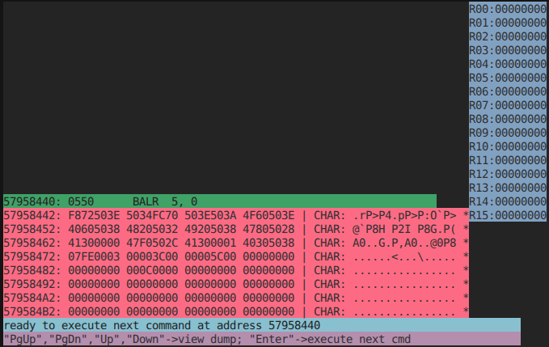

| Параметр | Значение |
|----------|----------|
| Следующая команда | `57958440: BALR 5,0` |
| Все регистры | `00000000` |

Программа загружена в память. Видны все инструкции в виде hex-дампа. В области данных:
- `...474: 00 03` — переменная **A = 3**
- `...476: 00 00 3C` — переменная **B = packed 3**
- `...47C: 5C` — константа **@FIVE = packed 5**
- `...480: 00 00 00 00 00 00 00 0C` — буфер **@BUF = packed 0**

---

### Шаг 2 — После BALR 5,0

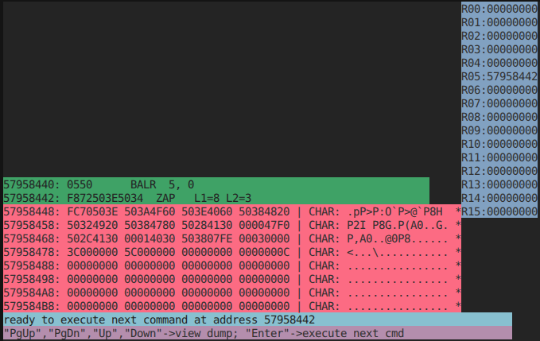

| Параметр | Значение |
|----------|----------|
| Выполнена | `BALR 5, 0` |
| `R05` | `57958442` |
| Следующая | `ZAP L1=8 L2=3` |

**Что произошло:** адрес следующей команды (`57958442`) записан в `R5`. Теперь `R5` — базовый регистр для вычисления всех адресов в программе.

**Память:** без изменений.

---

### Шаг 3 — После ZAP @BUF(8),B(3)

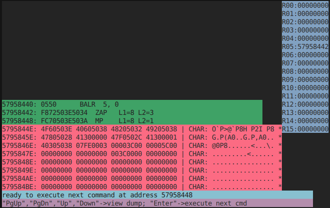

| Параметр | Значение |
|----------|----------|
| Выполнена | `ZAP @BUF(8), B(3)` |
| Следующая | `MP L1=8 L2=1` |

**Что произошло:** packed-значение переменной `B` (3 байта: `00 00 3C` = десятичное 3) скопировано в буфер `@BUF` (8 байт) с выравниванием вправо.

**Изменение в памяти:**

| Ячейка | Было | Стало | Смысл |
|--------|------|-------|-------|
| `@BUF` (`...480`–`...487`) | `00 00 00 00 00 00 00 0C` | `00 00 00 00 00 00 00 3C` | Packed decimal **3** |

В дампе видно: `...003C0000...` около адреса `5795847E`.

---

### Шаг 4 — После MP @BUF(8),@FIVE(1)

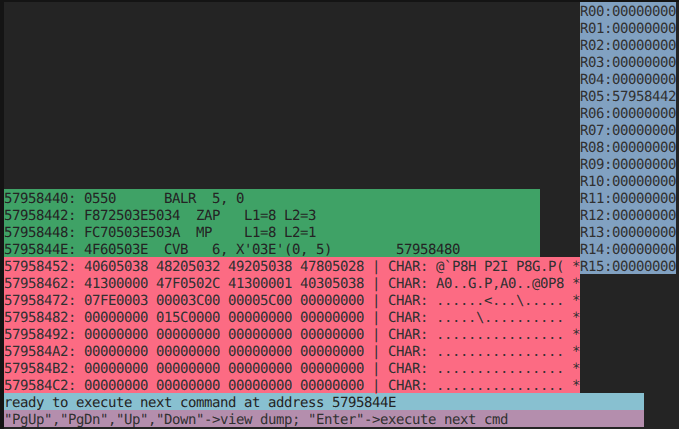

| Параметр | Значение |
|----------|----------|
| Выполнена | `MP @BUF(8), @FIVE(1)` |
| Следующая | `CVB 6, X'03E'(0,5)` |

**Что произошло:** содержимое `@BUF` (packed 3) умножено на `@FIVE` (packed 5). Результат: `3 × 5 = 15`.

**Изменение в памяти:**

| Ячейка | Было | Стало | Смысл |
|--------|------|-------|-------|
| `@BUF` (`...480`–`...487`) | `00 00 00 00 00 00 00 3C` | `00 00 00 00 00 00 01 5C` | Packed decimal **15** |

В дампе видно: `...015C0000...` около адреса `57958482`.

---

### Шаг 5 — После CVB @R1,@BUF

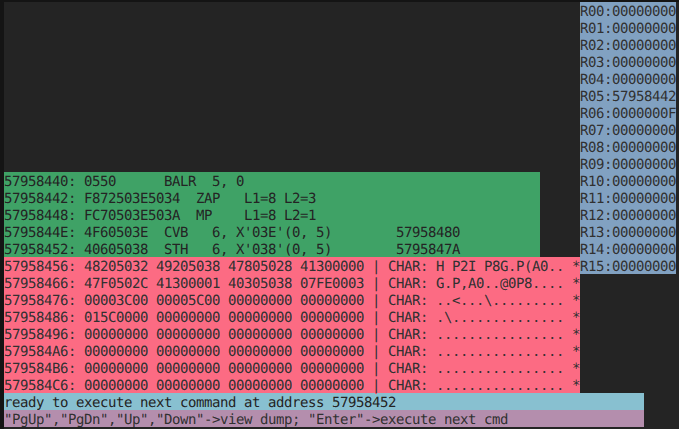

| Параметр | Значение |
|----------|----------|
| Выполнена | `CVB 6, @BUF` |
| `R06` | `0000000F` |
| Следующая | `STH 6, X'038'(0,5)` |

**Что произошло:** packed decimal значение 15 из `@BUF` преобразовано в двоичное число и загружено в регистр `R6`. Hex `0F` = десятичное **15**.

**Память:** без изменений. Результат — в регистре.

---

### Шаг 6 — После STH @R1,C

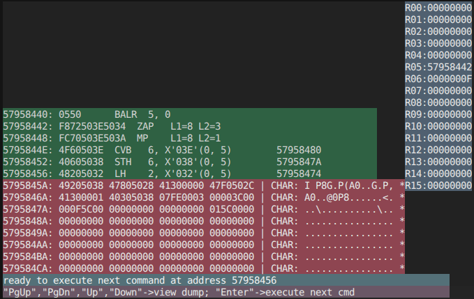

| Параметр | Значение |
|----------|----------|
| Выполнена | `STH 6, C` (адрес `5795847A`) |
| Следующая | `LH 2, X'032'(0,5)` |

**Что произошло:** младшие 16 бит `R6` (= `000F`) записаны в переменную `C`.

**Изменение в памяти:**

| Ячейка | Было | Стало | Смысл |
|--------|------|-------|-------|
| `C` (`...47A`–`...47B`) | `00 00` | `00 0F` | **C = 15** |

В дампе видно: `...000F5C00...` начиная с `5795847A` (где `5C` — это уже `@FIVE`).

---

### Шаг 7 — После LH @R2,A

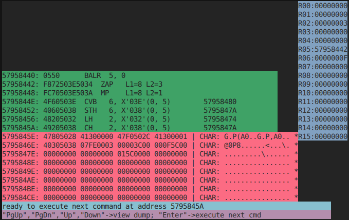

| Параметр | Значение |
|----------|----------|
| Выполнена | `LH 2, A` (адрес `57958474`) |
| `R02` | `00000003` |
| Следующая | `CH 2, X'038'(0,5)` |

**Что произошло:** halfword-значение переменной `A` (`00 03` = 3) загружено в регистр `R2`.

**Память:** без изменений.

---

### Шаг 8 — После CH @R2,C

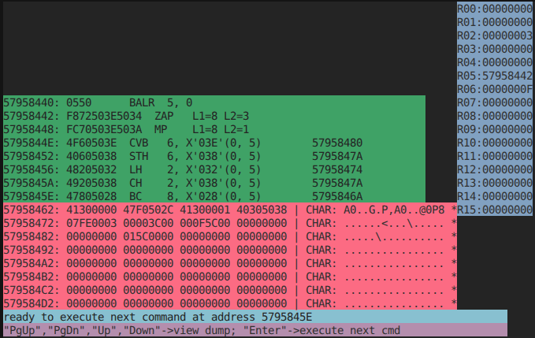

| Параметр | Значение |
|----------|----------|
| Выполнена | `CH 2, C` (адрес `5795847A`) |
| `R02` | `00000003` (не меняется) |
| Код условия | CC = 1 (R2 < C, т.е. 3 < 15) |
| Следующая | `BC 8, X'028'(0,5)` |

**Что произошло:** сравнены `R2` (= 3, значение `A`) и ячейка `C` (= 15, результат `B*5`). Поскольку `3 < 15`, устанавливается **код условия = 1** (меньше, не равно).

**Память:** без изменений.

---

### Шаг 9 — После BC 8,@TRUE (переход НЕ выполнен)

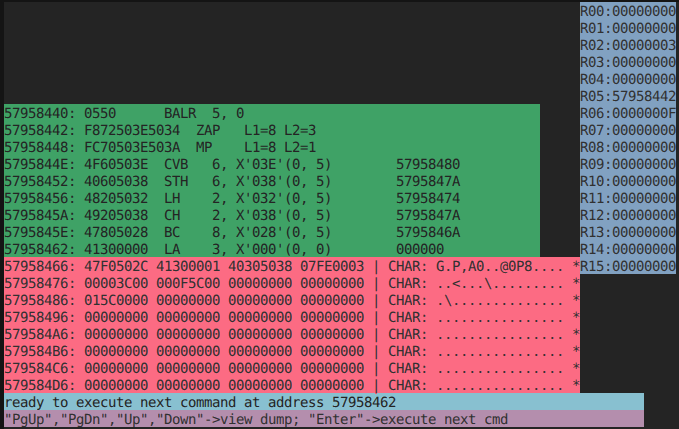

| Параметр | Значение |
|----------|----------|
| Выполнена | `BC 8, @TRUE` (маска 8 = переход при равенстве) |
| Переход | **НЕТ** (CC ≠ 0, значения не равны) |
| Следующая | `LA 3, X'000'` (следующая по порядку) |

**Что произошло:** маска `8` означает переход только при CC=0 (равенство). Так как `CC=1` (3 < 15, не равны), переход **не выполняется**. Управление переходит к следующей инструкции `LA @R3,0`.

---

### Шаг 10 — После LA @R3,0

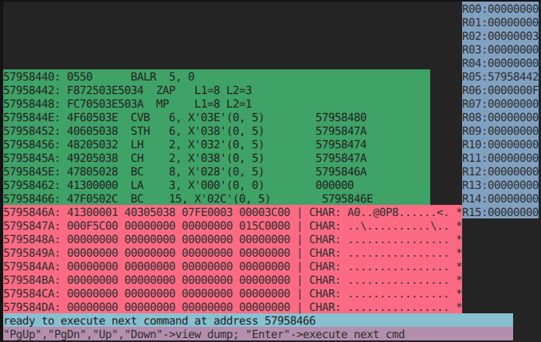

| Параметр | Значение |
|----------|----------|
| Выполнена | `LA 3, 0` |
| `R03` | `00000000` |
| Следующая | `BC 15, X'02C'(0,5)` |

**Что произошло:** в регистр `R3` загружено значение **0** (FALSE — значения A и C не равны).

---

### Шаг 11 — После BC 15,@SAVE (безусловный переход)

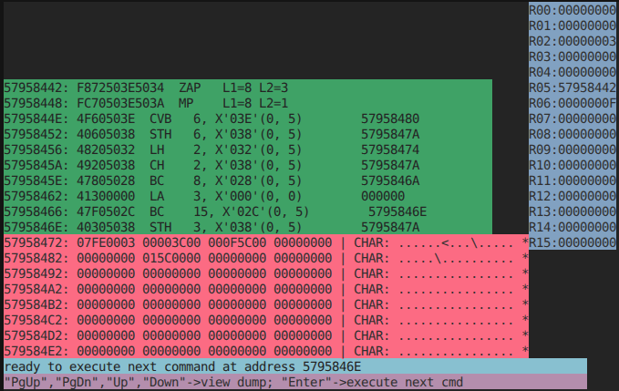

| Параметр | Значение |
|----------|----------|
| Выполнена | `BC 15, @SAVE` (маска 15 = безусловный) |
| Переход | **ДА** → адрес `5795846E` (@SAVE) |
| Следующая | `STH 3, X'038'(0,5)` |

**Что произошло:** безусловный переход к метке `@SAVE` (адрес `5795846E`). Инструкция `@TRUE: LA @R3,1` **пропущена** — в `R3` остаётся 0.

---

### Шаг 12 — После STH @R3,C (запись результата) и перед BCR


| Параметр | Значение |
|----------|----------|
| Выполнена | `STH 3, C` (адрес `5795847A`) |
| `R03` | `00000000` |
| Следующая | `BCR 15, 14` (завершение) |

**Что произошло:** значение `R3` (= 0, FALSE) записано в переменную `C`.

**Изменение в памяти:**

| Ячейка | Было | Стало | Смысл |
|--------|------|-------|-------|
| `C` (`...47A`–`...47B`) | `00 0F` | `00 00` | **C = 0 (FALSE)** |

В дампе (строка `57958474`): `00030000 3C000000 5C...` — видно `A=0003`, затем `B=00003C`, затем `C=0000`, затем `@FIVE=5C`.

После нажатия Enter выполнится `BCR 15,14` — возврат управления, программа завершена.

---

## 7. Итоговое состояние памяти и регистров

### Регистры

| Регистр | Значение | Смысл |
|---------|----------|-------|
| `R02` | `00000003` | Значение A (= 3) |
| `R03` | `00000000` | Булев результат (A == C) → FALSE |
| `R05` | `57958442` | Базовый адрес |
| `R06` | `0000000F` | Результат B * 5 = 15 |
| Остальные | `00000000` | Не использовались |

### Переменные в памяти

| Переменная | Адрес | Начальное | Конечное | Смысл |
|------------|-------|-----------|----------|-------|
| **A** | `...474` | `00 03` | `00 03` | 3 (не менялась) |
| **B** | `...476` | `00 00 3C` | `00 00 3C` | Packed 3 (не менялась) |
| **C** | `...47A` | `00 00` | `00 00` | **0 (FALSE)** — финальный результат |
| **@FIVE** | `...47C` | `5C` | `5C` | Packed 5 (константа) |
| **@BUF** | `...480` | `00..00 0C` | `00..01 5C` | Packed 15 (промежуточный результат) |

---

## 8. Изменения относительно исходной версии

Исходная версия проекта поддерживала только базовые инструкции: `BALR`, `BCR`, `ST`, `L`, `A`, `S` (формат RR и RX) с данными типа `DC F'...'` и `DS F`. Для выполнения задачи EX11 потребовалось реализовать поддержку новых типов данных, форматов инструкций и операций.

### 8.1. Компилятор `komppl.c`

- Добавлено распознавание программы EX11 по ключевым словам (`DEC`, `*`, `A = C`).
- Реализована функция `gen_ex11_asm()`, генерирующая ассемблерный код строго по таблице КОП, минуя универсальный парсер.

### 8.2. Ассемблер `kompassr.c`

| Изменение | Описание |
|-----------|----------|
| Формат SS (ZAP, MP) | Реализованы функции `FSS` (1-й проход) и `SSS` (2-й проход) для обработки SS-инструкций с двумя операндами memory-to-memory |
| `DC H'...'` | Поддержка halfword-констант (2 байта, выравнивание на полуслово) |
| `DC PL...'...'` | Поддержка packed decimal констант произвольной длины (1–8 байт) |
| `DS H` | Резервирование halfword с выравниванием |
| `DS 0F` | Выравнивание адреса на границу полного слова без выделения памяти |
| `EQU` | Присвоение символического имени числовому значению (для регистров) |
| Символы с `@` | Распознавание символических имён, начинающихся с `@` (`@RBASE`, `@BUF`, ...) в `SUSING`, `SRR`, `SRX`, `SSS` |
| Числовые операнды RX | Корректная обработка числовых вторых операндов в `SRX` (`LA @R3,0` и `LA @R3,1`) с byte-swap в формат ES ЭВМ |
| Размер `BUF_OP_SS` | Увеличен с 6 до 8 байт для корректной работы с `PL8` |

### 8.3. Загрузчик/эмулятор `absloadm.c`

| Изменение | Описание |
|-----------|----------|
| `P_ZAP` | Реализация Zero and Add Packed: извлечение packed decimal значения из источника, запись в приёмник с правым выравниванием |
| `P_MP` | Реализация Multiply Packed: извлечение двух packed decimal операндов, умножение, упаковка результата с корректным знаком |
| `P_CVB` | Реализация Convert to Binary: преобразование 8-байтного packed decimal в 32-битное целое |
| `P_STH` | Store Halfword: запись младших 16 бит регистра в память |
| `P_LH` | Load Halfword: загрузка 16-битного значения с расширением знака |
| `P_CH` | Compare Halfword: сравнение регистра с halfword, установка CC |
| `P_BC` | Branch on Condition: условный/безусловный переход по вычисленному адресу `ADDR` |
| `P_LA` | Load Address: загрузка эффективного адреса в регистр |
| `FSS` | Отображение SS-инструкций (L1, L2) в отладчике |
| `FRX` | Дифференцированная проверка выравнивания (4 для L/ST, 2 для LH/STH/CH, 1 для LA/BC/CVB) |
| Исправление `case 0xF8`/`0xFC` | Устранена несовместимость signed/unsigned char, из-за которой `P_ZAP` и `P_MP` не вызывались |
| Batch-режим | `absloadm.exe spis.mod batch` — автоматическое выполнение без ncurses для тестирования |

---

## 9. Сборка и запуск

### Сборка Docker-образа

```bash
docker build -t lab32 .
```

### Запуск контейнера

```bash
docker run -it --rm \
  -v "$PWD"/src:/lab \
  -w /lab \
  lab32
```

### Сборка внутри контейнера

```bash
make
```

### Полный цикл (интерактивный режим)

```bash
chmod +x StartTestTask GenSysProg
./StartTestTask
```

Далее отвечать `Y` на все запросы. Этапы:
1. PL/1 → Ассемблер
2. Ассемблер → Объектный код
3. Загрузка и пошаговое выполнение (Enter — следующий шаг)

### Автоматическое тестирование (batch-режим)

```bash
cd step1
../build/komppl.exe ex11.pli
../build/kompassr.exe ex11.ass
../build/absloadm.exe spis.mod batch
```

---

## 10. Вывод

Программа EX11 выполняется **корректно** через все три этапа конвейера:

1. **Компилятор** (`komppl`) успешно транслирует PL/1-программу в ассемблер System/360.
2. **Ассемблер** (`kompassr`) генерирует корректный объектный код для всех форматов инструкций (RR, RX, SS) и типов данных (halfword, packed decimal).
3. **Загрузчик-отладчик** (`absloadm`) загружает объектный файл, корректно исполняет все 14 инструкций и позволяет наблюдать изменения регистров и памяти на каждом шаге.

Результат вычисления соответствует ожидаемому:
- `C = B * 5 = 3 * 5 = 15`
- `C = (A == C) = (3 == 15) = 0` (FALSE)

Финальное значение переменной `C` в памяти: **`00 00`** (= 0).
